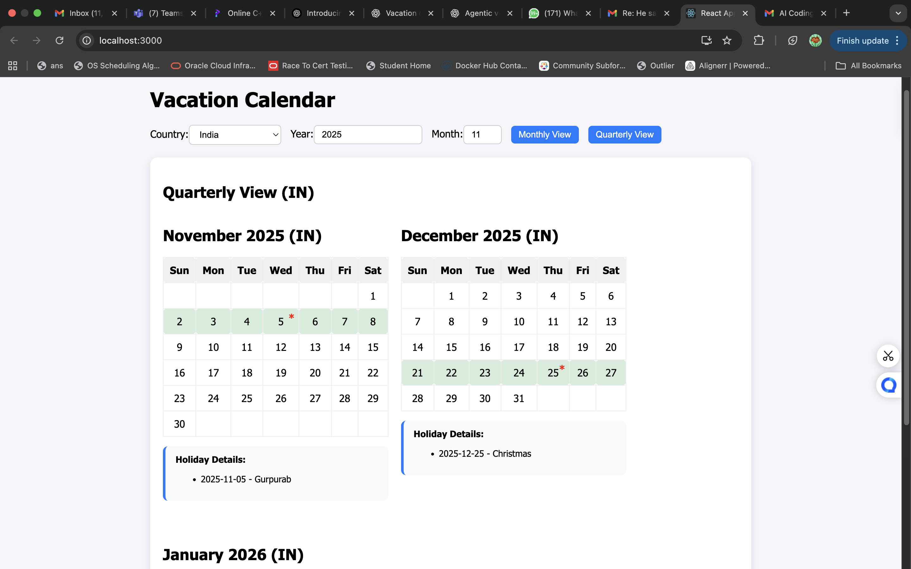
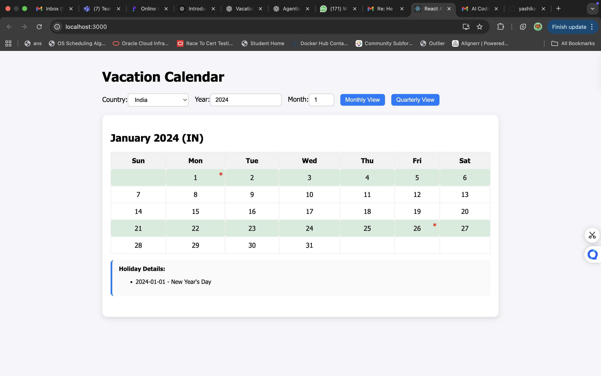
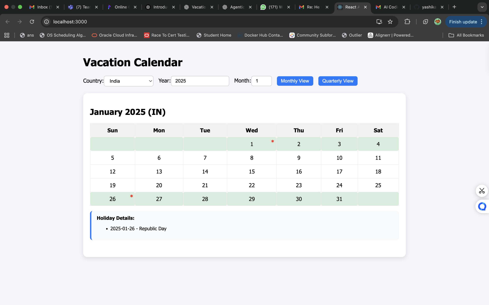

# 🌴 Vacation Calendar

A **fully interactive vacation calendar** web application that allows users to view monthly and quarterly holidays for different countries. The calendar highlights holidays, shows details on click, and provides a modern, responsive UI.

---

## 🔹 Features

- Monthly and Quarterly views of the calendar  
- Highlights **holidays** with colored rows:
  - 1 holiday in a week → light green  
  - 2+ holidays in a week → dark green  
- <h2> <b>Holiday marker (*) on dates with holidays   </b></h2>
- Click on a date to see **holiday details** below the calendar  
- Select **country**, **year**, and **month**  
- 
  
  - data stored on separate json file  )(no hardcoding)

---

## 🌐 Technologies Used

| Frontend          | Backend        | Others                  |
|-----------------|----------------|------------------------|
| React.js        | Node.js        | Axios                  |
| Day.js          | Express.js     | CORS                   |
| CSS / Inline Styles | Nager.Date API | Git & GitHub           |

---

---

## 🚀 Setup Instructions

### **1. Clone the repository**
```bash
git clone https://github.com/yashikaBhandari/vacation_calender.git
```

##  Setup Backend
```bash
cd server
npm install
node server.js
```

## Backend runs on http://localhost:4000


```bash
Setup Frontend
cd ../client
npm install
npm start
```

## Frontend runs on http://localhost:3000


## Usage

- Open the app in the browser.

- Select Country, Year, and Month.

- Switch between Monthly and Quarterly views.

- Dates with holidays show a red star (*).

- Click on a holiday date to see holiday details below the calendar.

##  UI Preview


### Monthly View



### Quarterly View


###  monthly view 





## Future Enhancements

- Fetch holidays dynamically for India from an external API (instead of hardcoded)

- Add user authentication to save custom holidays

- Add event creation feature

- Make calendar fully responsive and mobile-friendly
